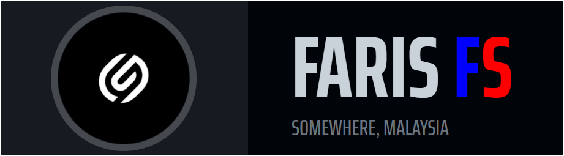
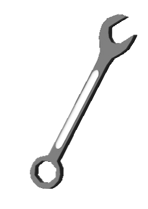
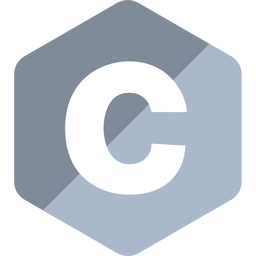

## 

##  Hello, folks!

- 👋 Hi, I’m FarisFs
- 👀 I’m interested in Software Development
- 🌱 I’m currently learning Laravel Framework
- 📫 You guys can reach me at <a href="https://www.linkedin.com/in/farisfsx/" target="_blank">here!</a>

##  Technologies & Tools

##  Languages

<!---
farisfs73x/farisfs73x is a ✨ special ✨ repository because its `README.md` (this file) appears on your GitHub profile.
You can click the Preview link to take a look at your changes.
--->
